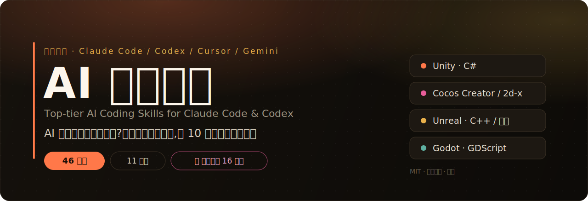

<p align="center">
  <a href="https://wade-devcode.github.io/awesome-coding-skills-cn/">
    
  </a>
</p>

# 🤖 顶级 AI 编程技能集（中文优先）
### Top-tier AI Coding Skills for Claude Code / Codex — China-first, bilingual

[](https://github.com/Wade-DevCode/awesome-coding-skills-cn/stargazers)
[](LICENSE)
[](README.en.md)

**🌐 在线目录:[wade-devcode.github.io/awesome-coding-skills-cn](https://wade-devcode.github.io/awesome-coding-skills-cn/)** · **🔥 实战对照:[装技能前 vs 后](showcase/README.md)**

---

> **AI 改代码总把你项目改崩？这套中文技能集让它像 10 年老兵一样干活。**
>
> *Tired of AI turning your codebase into chaos? These skills make it work like a seasoned engineer — disciplined, surgical, and safe.*

---

## ⚡ 30 秒上手

```bash
git clone https://github.com/Wade-DevCode/awesome-coding-skills-cn.git
cd awesome-coding-skills-cn && bash install.sh   # 装全部 46 技能;Windows 用 ./install.ps1
```

> 不装也行:把 [`CLAUDE.md`](CLAUDE.md) 拖进项目根目录,立刻生效。
> 嫌每次提醒麻烦?配 [`hooks/`](hooks/) 让纪律自动注入每次对话。
> 想先逛逛:[在线目录站](https://wade-devcode.github.io/awesome-coding-skills-cn/) · [实战对照](showcase/README.md)
>
> **顺手点个 ⭐ Star,帮更多中文开发者刷到它。**

---

## 这是什么 / What is this

这是一套专为中文开发者打磨的 AI 编程纪律技能集，覆盖 Claude Code、Codex、Cursor、Gemini CLI 等主流 AI 编程工具。每个技能都是从真实踩坑中提炼的可执行规则，不是理论口号。

安装后，AI 会在改代码前先读懂约束：不造假 API、不乱改无关代码、不过度工程、不凭直觉猜假设——该问就问，该测就测。

*A battle-tested set of bilingual AI coding discipline skills. Drop them into any project and your AI assistant follows real engineering constraints, not vibes.*

---

## 快速开始 / Quick Start

### 方式 A — 一键安装（推荐，适用于 Claude Code）

**macOS / Linux:**
```bash
git clone https://github.com/Wade-DevCode/awesome-coding-skills-cn.git && cd awesome-coding-skills-cn && bash install.sh
```

**Windows (PowerShell):**
```powershell
git clone https://github.com/Wade-DevCode/awesome-coding-skills-cn.git; cd awesome-coding-skills-cn; ./install.ps1
```

安装脚本会把 `skills/` 下的所有技能复制到 `~/.claude/skills/`，重启 Claude Code 即可使用。

---

### 方式 B — 懒人版（适用于 Codex / Cursor / Gemini 或任何 AI 工具）

把 `CLAUDE.md`（或 `AGENTS.md`）直接复制到你的项目根目录即可。

```bash
# Claude Code 用户
cp CLAUDE.md /your/project/

# Codex / Cursor / Gemini CLI 用户
cp AGENTS.md /your/project/
```

AI 会在进入项目时自动读取这个文件，按其中的纪律规则行事。

---

### 方式 C — CLI 浏览与按需安装

仓库自带零依赖 Node CLI(需 Node 16+),可浏览、搜索、选择性安装技能:

```bash
node bin/skills.js list              # 列出全部 46 个技能(按分类)
node bin/skills.js list backend      # 只看某分类
node bin/skills.js search docker     # 按名称/说明/标签搜索
node bin/skills.js info core-discipline   # 看某技能详情与全文
node bin/skills.js install security  # 安装单个技能 / 整个分类 / all
```

`install` 会把技能拷到 `~/.claude/skills/`。数据源为 `catalog.json`(由 `node scripts/build-catalog.mjs` 生成)。

---

### 方式 D — 自动钩子(给 AI 戴紧箍咒)

不想每次提醒?用 **Claude Code hooks** 把核心纪律自动注入每次对话。一次配置,永久生效:

```jsonc
// 合并进 ~/.claude/settings.json
{ "hooks": { "SessionStart": [ { "hooks": [
  { "type": "command", "command": "bash <仓库路径>/hooks/inject-discipline.sh" }
] } ] } }
```

完整说明(含 Windows / UserPromptSubmit 版本)见 [`hooks/`](hooks/)。

---

## 技能清单 / Skills

**46 个技能,11 大分类**(含 🎮 游戏开发专项)。下表由 `catalog.json` 自动生成(`node scripts/build-catalog.mjs`)。

### 通用纪律

| 技能 | 作用 |
|------|------|
| `code-review-self` | 提交/交付前自我代码审查时使用。像 reviewer 一样挑自己的刺。 |
| `core-discipline` | 写/改任何代码前必读。约束 AI 避免造假 API、过度工程、大范围乱改。 |
| `large-repo-refactor` | 在大型存量代码库做重构时使用。控制影响面,小步推进,不破坏现有行为。 |
| `legacy-safe-edit` | 在已有/老代码库里改动时使用。最大限度降低改崩存量功能的风险。 |
| `naming-things` | 命名变量/函数/类型时使用。名字表达意图,不表达实现。 |
| `requirement-delivery` | 接到新需求、要从需求快速走到可交付时使用。先理清再动手,高效落地。 |
| `systematic-debugging` | 遇到 bug、测试失败、行为异常时使用。先定位根因,再改代码,禁止瞎试。 |
| `test-driven` | 实现功能或修 bug 前使用。先写会失败的测试,再写实现。 |

### 🎮 游戏开发

| 技能 | 作用 |
|------|------|
| `unity-csharp` | 写 Unity C# 时使用。生命周期、协程、GC、性能、序列化的实战规范。 |
| `cocos2dx-lua` | 写 Cocos2d-x Lua 时使用。节点、触摸、动作、调度器、ccui、内存的实战规范。 |
| `cocos-creator` | 写 Cocos Creator（TypeScript）时使用。组件、节点、prefab、事件、资源管理规范。 |
| `cocos-creator-bundle` | 用 AssetBundle 做分包/远程资源时使用。加载、释放、依赖、缓存。 |
| `cocos-creator-hotupdate` | 给 Cocos Creator 原生包做热更新时使用。manifest、增量、校验、回滚。 |
| `cocos-creator-drawcall` | 优化 Cocos Creator 渲染时使用。合批、图集、动静分离、Label。 |
| `cocos-creator-adaptation` | 多机型/多分辨率适配。Canvas、Widget、安全区。 |
| `cocos-creator-ui-list` | 大量条目列表优化。虚拟列表、节点复用。 |
| `cocos-creator-tween-anim` | 动效/动画。tween、Animation、Spine、性能与清理。 |
| `unreal-cpp` | 写 Unreal C++/蓝图时使用。UObject/GC、反射宏、Tick 性能、蓝图边界。 |
| `godot-gdscript` | 写 Godot（GDScript/C#）时使用。节点树、signal、场景、性能规范。 |
| `game-performance` | 优化游戏性能时使用。帧率、GC、Draw Call、对象池、分帧的通用规范。 |
| `gameplay-architecture` | 设计游戏玩法代码结构时使用。状态机、解耦、避免 God object。 |
| `game-netcode` | 写多人/联网游戏时使用。同步模型、延迟、断线、防作弊。 |
| `game-assets-memory` | 管理游戏资源与内存时使用。加载/卸载、图集、包体、泄漏防治。 |
| `game-math` | 写移动/碰撞/相机等游戏逻辑时使用。向量、插值、帧率无关。 |

### 前端

| 技能 | 作用 |
|------|------|
| `frontend-best-practices` | 写 React/Vue 前端代码时使用。组件、状态、性能、可访问性的实战规范。 |

### 后端

| 技能 | 作用 |
|------|------|
| `api-design` | 设计 HTTP/REST 接口时使用。资源命名、状态码、版本、错误响应的规范。 |
| `concurrency-safety` | 写并发/异步代码时使用。防止竞态、死锁、资源泄漏。 |
| `database-safety` | 写 SQL、改表结构、做数据迁移时使用。防止锁表、丢数据、慢查询。 |
| `error-handling` | 处理错误与异常时使用。不吞异常、不裸抛、给出可恢复信息。 |

### DevOps

| 技能 | 作用 |
|------|------|
| `ci-cd-pipeline` | 配置 CI/CD 流水线时使用。快、稳、可重复、可回滚。 |
| `docker-best-practices` | 写 Dockerfile / 容器化应用时使用。镜像小、构建快、运行安全。 |
| `shell-scripting-safe` | 写 shell/bash 脚本时使用。防止静默失败与误删。 |

### 安全

| 技能 | 作用 |
|------|------|
| `input-validation` | 处理外部输入时使用。在边界统一校验，防脏数据与注入。 |
| `secrets-handling` | 处理密钥/凭据/token 时使用。防止泄露进代码、日志、前端。 |
| `security-review` | 审查代码安全性时使用。覆盖注入、认证、越权、敏感数据等常见风险。 |

### 语言

| 技能 | 作用 |
|------|------|
| `go-idioms` | 写 Go 时使用。地道 Go：错误处理、并发、接口的正确姿势。 |
| `node-best-practices` | 写 Node.js 后端时使用。异步、错误、依赖与安全的实战规范。 |
| `python-idioms` | 写 Python 时使用。地道、安全、可维护的 Python 写法。 |
| `rust-safety` | 写 Rust 时使用。所有权、错误处理、unsafe 的正确实践。 |

### 测试

| 技能 | 作用 |
|------|------|
| `integration-testing` | 写集成/端到端测试时使用。测真实交互,稳定不脆弱。 |
| `test-data-management` | 管理测试数据/fixture 时使用。可复现、隔离、易维护。 |

### 文档

| 技能 | 作用 |
|------|------|
| `pr-description` | 写 Pull Request 描述时使用。让 reviewer 快速理解与审查。 |
| `writing-docs` | 写 README/技术文档时使用。让读者快速上手。 |

### 性能

| 技能 | 作用 |
|------|------|
| `performance-profiling` | 优化性能时使用。先测量定位再优化,不凭感觉。 |

### 中文特色

| 技能 | 作用 |
|------|------|
| `chinese-commit` | 写 git commit 时使用。生成规范的 Conventional Commits(英文 type + 中文主题),主题精炼。 |
| `domestic-stack` | 写 uniapp / 微信小程序 / SpringBoot 代码时使用。贴合国内主流技术栈的实战规范。 |

---

## 支持的工具 / Supported Tools

| 工具 | 使用方式 |
|------|----------|
| **Claude Code** | 方式 A（`install.sh` / `install.ps1`）安装 skills，或方式 B 放 `CLAUDE.md` |
| **Codex / Cursor / Gemini CLI** | 方式 B 放 `AGENTS.md` 到项目根目录 |
| **任何支持 system prompt 的 AI 工具** | 把 `CLAUDE.md` 内容贴入 system prompt |
| **想自动注入纪律** | 方式 D 配置 [`hooks/`](hooks/),每次对话自动生效 |

---

## 为什么用它 / Why

- **🎯 从真实踩坑提炼** — 每条规则都对应一类具体的 AI 事故：造假 API、大范围乱改、凭直觉瞎猜假设，不是空洞口号
- **⚔️ 实战纪律，不是最佳实践清单** — 规则带有"为什么"和反例，AI 理解后才真正遵守，而不是走过场
- **🌐 跨平台即插即用** — Claude Code 技能 + CLAUDE.md + AGENTS.md 三种形态，覆盖主流 AI 编程工具
- **🇨🇳 中文优先，面向中国开发者** — 规则用中文写就更精准，AI 解读时不会因翻译损失语义

---

## 和其他做法比 / Comparison

| | 啥都不做 | 一句 CLAUDE.md | **本仓库** |
|---|:---:|:---:|:---:|
| 覆盖纪律面 | ❌ | 几条 | ✅ 46 技能 / 11 分类 |
| 🎮 游戏开发专项 | ❌ | ❌ | ✅ Unity/Cocos/Unreal/Godot |
| 带"为什么"+反例 | ❌ | 偶尔 | ✅ 每条都有 |
| 跨平台(Claude/Codex/Cursor/Gemini) | ❌ | 部分 | ✅ |
| 按需选装 / CLI 浏览 | ❌ | ❌ | ✅ `bin/skills.js` |
| 自动注入(hooks) | ❌ | ❌ | ✅ 见 [`hooks/`](hooks/) |
| 中文优先 | ❌ | 看作者 | ✅ |
| 可视化目录 | ❌ | ❌ | ✅ [在线站点](https://wade-devcode.github.io/awesome-coding-skills-cn/) |

---

## 常见问题 / FAQ

**Q:和 Karpathy 那个 CLAUDE.md 有啥区别?**
那是一个文件、几条通用纪律。这里是 46 个分门别类的技能(还含 Unity/Cocos/Unreal/Godot **游戏开发专项**),每条带"为什么+正反例",还有 CLI、自动钩子、可视化目录,且**中文优先**。

**Q:只用 Claude Code 吗?**
不。`skills/` 给 Claude Code;`CLAUDE.md` / `AGENTS.md` 给 Codex / Cursor / Gemini / 任何读 system prompt 的工具。

**Q:会拖慢 AI 吗?**
不会。技能是按场景触发的轻量规则文本,不是常驻大上下文。

**Q:能只装我需要的吗?**
能。`node bin/skills.js install <技能名|分类|all>` 按需选装。

**Q:能改成我团队的规约吗?**
能。每个 `SKILL.md` 都是纯 markdown,直接改;钩子脚本里的纪律文本也能换。

---

## ⭐ 觉得有用?

点个 Star 让更多中文开发者刷到它 —— 这是对项目最大的支持。也欢迎提 PR 贡献你踩过的坑(见 [CONTRIBUTING](CONTRIBUTING.md))。

[](https://star-history.com/#Wade-DevCode/awesome-coding-skills-cn&Date)

---

## English version

English version → [README.en.md](README.en.md)

---

## License

[MIT](LICENSE) — 自由使用、修改、分发。
